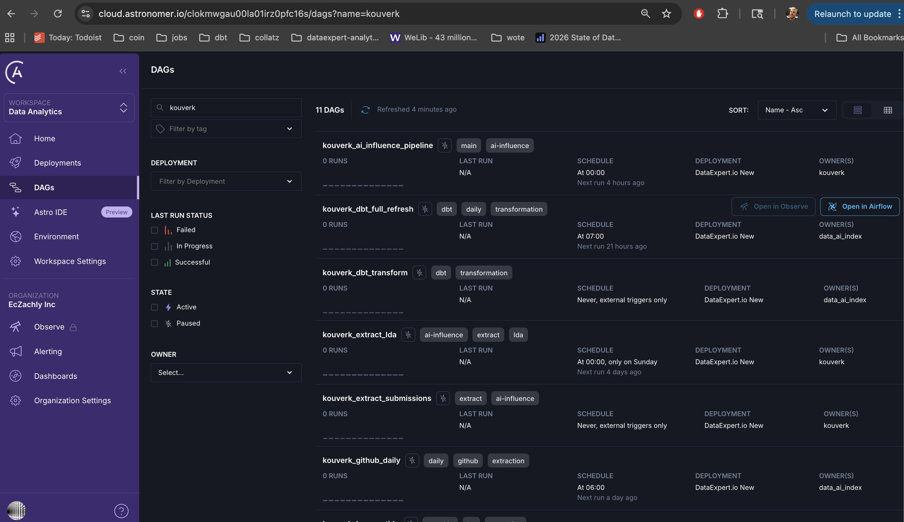
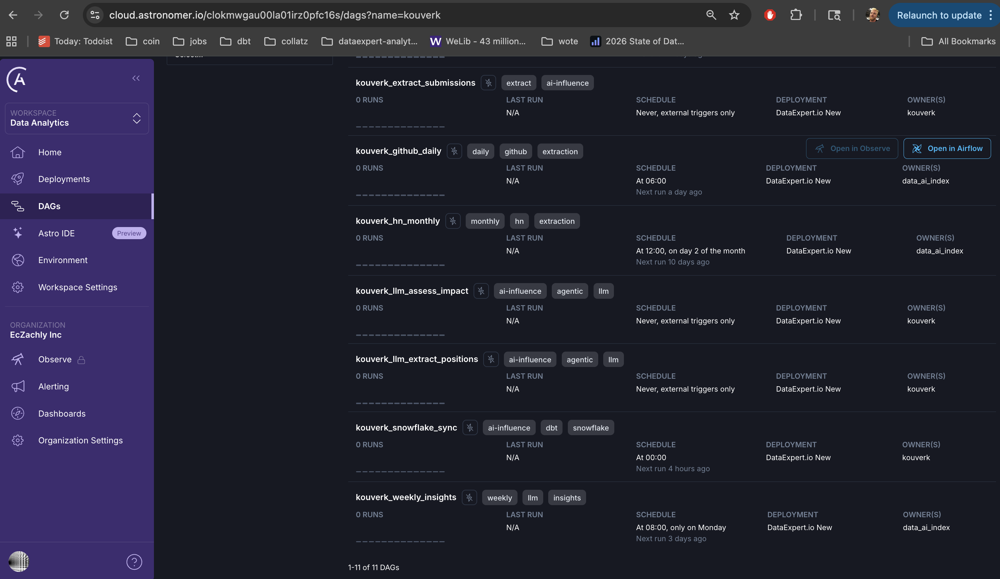

# Screenshots

Visual documentation of the AI Intelligence Platform deployment.

---

## Astronomer Deployment

Evidence of Airflow DAGs deployed to Astronomer Cloud.

### DAG List View

Shows all 11 `kouverk_*` DAGs deployed to the Astronomer Cloud environment.

### DAG Detail View

Filtered view showing the DAG deployment with Astronomer URL visible.

---

## Live Dashboard

Instead of static screenshots, view the live Streamlit dashboard:

**[AI Intelligence Platform Dashboard](https://ai-intelligence-platform-kouverk.streamlit.app/)**

The unified dashboard provides:
- Market Signals: Technology trends, role evolution, LLM vs regex comparison
- Policy Signals: Discrepancy scores, lobbying analysis, China rhetoric tracking

---

## DAGs Deployed

| DAG Name | Pipeline | Schedule |
|----------|----------|----------|
| `kouverk_hn_monthly` | Market | Monthly (2nd) |
| `kouverk_github_daily` | Market | Daily |
| `kouverk_linkedin_load` | Market | Manual |
| `kouverk_dbt_daily` | Market | Daily |
| `kouverk_extract_lda` | Policy | Weekly |
| `kouverk_llm_extract_positions` | Policy | Manual |
| `kouverk_llm_assess_impact` | Policy | Manual |
| `kouverk_snowflake_sync` | Policy | Daily |
| `kouverk_ai_influence_pipeline` | Policy | Weekly |
| `kouverk_llm_weekly_insights` | Market | Weekly |
