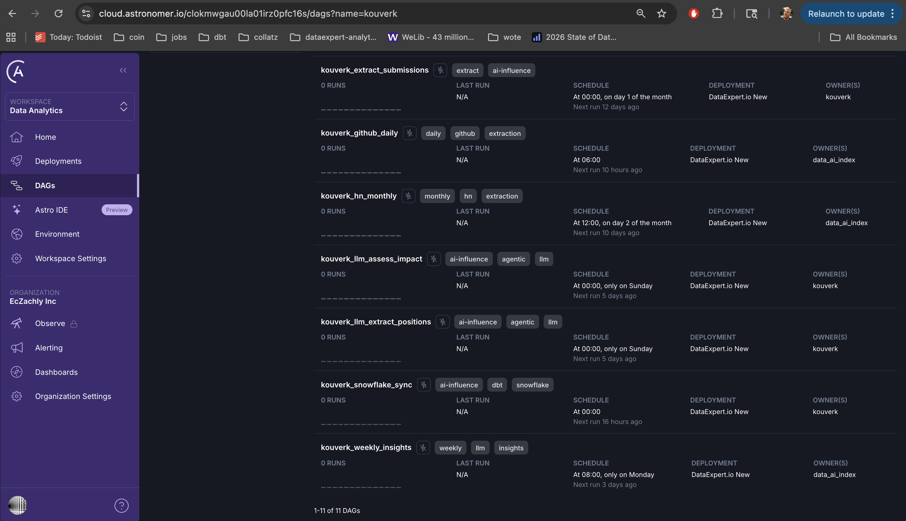

# Screenshots

Visual documentation of the AI Intelligence Platform deployment.

## Folder Structure

```
screenshots/
├── astronomer_deployed_dags_1.png    # Astronomer Cloud DAG list
├── astronomer_deployed_dags_2.png    # Astronomer Cloud DAG detail
├── airflow/                          # DAG execution screenshots
│   ├── ai_influence_pipeline_dag_graph.png
│   ├── dbt_transform_dag_graph.png
│   ├── dbt_transform_dag_success_1.png
│   ├── dbt_transform_dag_success_2.png
│   ├── extract_lda_lobbying_running.png
│   ├── extract_lda_lobbying_success_1.png
│   ├── extract_lda_lobbying_success_2.png
│   ├── snowflake_sync_dag_graph.png
│   └── snowflake_sync_dag_success.png
├── dbt/                              # dbt test screenshots
│   ├── market_signals_dbt_tests_1.png
│   ├── market_signals_dbt_tests_2.png
│   ├── market_signals_dbt_tests_3.png
│   ├── policy_signal_dbt_tests_1.png
│   └── policy_signal_dbt_tests_2.png
└── streamlit_dashboard/              # Dashboard screenshots
    ├── market_signals_screenshots/   # 20 screenshots
    └── policy_signals_screenshots/   # 17 screenshots
```

---

## Astronomer Deployment

Evidence of Airflow DAGs deployed to Astronomer Cloud.




---

## Airflow DAG Execution

Screenshots showing successful DAG runs and graph views.

| Screenshot | Description |
|------------|-------------|
| `ai_influence_pipeline_dag_graph.png` | Main pipeline orchestration graph |
| `dbt_transform_dag_graph.png` | dbt transformation DAG graph |
| `dbt_transform_dag_success_*.png` | Successful dbt runs |
| `extract_lda_lobbying_*.png` | LDA lobbying extraction runs |
| `snowflake_sync_dag_*.png` | Snowflake sync DAG |

---

## dbt Tests

Screenshots showing successful dbt test runs for both pipelines.

- **Market Signals**: 3 screenshots showing test passes
- **Policy Signals**: 2 screenshots showing test passes

---

## Streamlit Dashboard

Instead of static screenshots, view the live dashboard:

**[AI Intelligence Platform Dashboard](https://ai-intelligence-platform-kouverk.streamlit.app/)**

Static screenshots are organized by pipeline:
- `market_signals_screenshots/` - 20 screenshots covering all dashboard pages
- `policy_signals_screenshots/` - 17 screenshots covering all dashboard pages

---

## DAGs Deployed

| DAG Name | Pipeline | Schedule |
|----------|----------|----------|
| `kouverk_hn_monthly` | Market | Monthly (2nd) |
| `kouverk_github_daily` | Market | Daily |
| `kouverk_linkedin_load` | Market | Manual |
| `kouverk_dbt_daily` | Market | Daily |
| `kouverk_extract_lda` | Policy | Weekly |
| `kouverk_llm_extract_positions` | Policy | Manual |
| `kouverk_llm_assess_impact` | Policy | Manual |
| `kouverk_snowflake_sync` | Policy | Daily |
| `kouverk_ai_influence_pipeline` | Policy | Weekly |
| `kouverk_llm_weekly_insights` | Market | Weekly |
